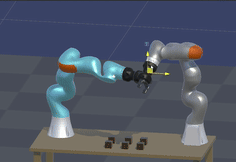

# H2B_MotionBridge

**Note: This is a new project with untested parameters. Please use at your own risk.**

This Unity project (v2022.3.13f1) is indented for scientific work on human to robot natural motion tranfer in unstructured and unstable environment, in which robots perform object manipulation tasks. 
The heart of the code is based on Unity's ArticulationBodies, driven by NVIDIA's PhysX physics engine for accurate robotic simulation and hand/gripper object interactions during grasping. 

**Pre-requisites**
<dl>
  <dt>Hardware:</dt>
  <dd> Windows-10 PC with a Meta Desktop compatible GPU, which excludes the RTX3050 and the RTX3050Ti</dd>
  <dd> Meta Quest headsets (versions 1,2,3 or Pro are all compatible) with hand-tracking enabled </dd>
  <dd> Meta Link cable </dd>

  <dt>Software:</dt>
  <dd> Meta Desktop app </dd>
  <dd> Unity v2022.3.13f1 </dd>
  <dd> Unity's OpenXR package for VR and hand-tracking access for Meta devices </dd>

  <dt>Optional (untested alternatives):</dt>
  <dd> Steam and SteamVR </dd>
  <dd> Leap Motion hand-tracking </dd> 
</dl>

This image shows two KUKA iiwa-7 arms. The arm on the right (physics-arm) is the one we are mainly using for this project. The arm on the left (inverse kinematics arm (IK-arm)) is for comparison purposes only.

The physics-arm is based on a chain of articulation bodies that are driven by forces based on the target object position. The target object by default will be the user's right hand index finger tip, provided by the Meta Quest hand tracking package. 

